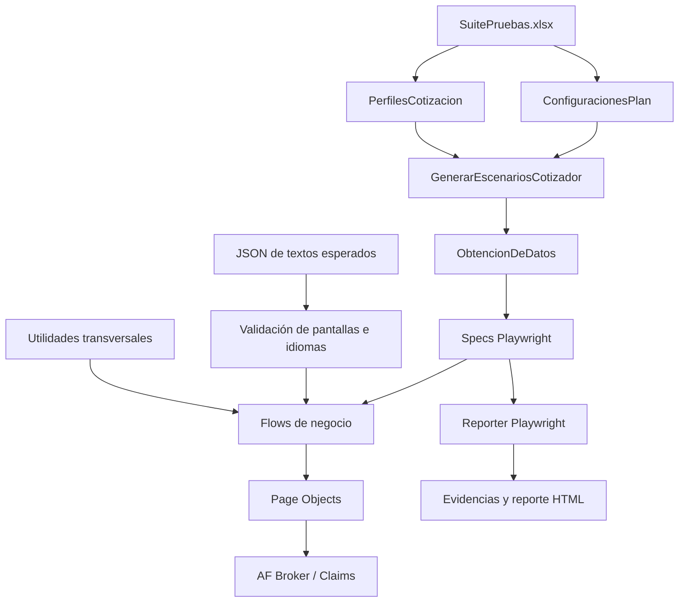

# Arquitectura

## Objetivo

La arquitectura busca que los tests sean legibles y que el detalle de interfaz sea reutilizable. Sigue el mismo criterio usado en otros proyectos de automatización del equipo: `spec → flow → page object`, complementado aquí con datos Excel, contratos JSON y utilidades transversales.

No se propone una refactorización total. Toda extensión debe reutilizar las capas existentes y evitar duplicar selectores, pasos o lectores de datos.

## Vista de componentes



## Capas y responsabilidades

### Specs: `src/tests/`

Responsabilidad:

- Convertir cada escenario generado desde Excel en un test.
- Instanciar y llamar flows en el orden del escenario.
- Seleccionar el alcance funcional del caso.

No deben contener selectores, generación detallada de datos ni lógica extensa de pantalla. Los recorridos están separados en `cotizacionesFamiliaresAF.spec.ts`, `cotizacionesIndividualesAF.spec.ts` y `emisionClaimsAF.spec.ts`.

### Flows: `src/flows/`

Responsabilidad:

- Orquestar varias acciones de Page Objects.
- Interpretar valores funcionales del Excel.
- Expresar bifurcaciones de negocio.
- Ejecutar validaciones que determinan el avance del flujo.

Los flows no deberían repetir selectores. Actualmente existen accesos directos a `page.locator()` en algunos flows; deben considerarse excepciones heredadas y migrarse gradualmente cuando se modifique esa zona.

### Page Objects: `src/paginas/`

Responsabilidad:

- Encapsular selectores.
- Exponer acciones atómicas sobre la interfaz.
- Ocultar detalles de iframe, carga de archivos, escritura y clics.

Reglas:

- Reutilizar el Page Object existente antes de crear otro.
- Preferir localizadores estables: roles, etiquetas, texto contractual o identificadores controlados.
- Mantener los `frameLocator('iframe#ifCotizador')` dentro de esta capa cuando la acción pertenece al cotizador.
- No incluir un recorrido completo de negocio en una sola acción de página.

### Configuración: `src/configuraciones/`

- `playwright.config.ts`: define directorio de pruebas, timeout, workers, reporteros, proyectos y política de evidencia.
- `validacionesPantallas.ts`: mapea una pantalla a iframe, placeholders y archivos de textos por idioma.

El `playwright.config.ts` de la raíz es el punto de entrada y reexporta la configuración de `src/configuraciones/`. Debe editarse la fuente TypeScript, no el archivo JavaScript heredado de la raíz.

### Datos y contratos

- `src/datos/SuitePruebas.xlsx`: catálogos data-driven de configuraciones y perfiles.
- `src/datos/PruebaAF.pdf` y `src/datos/Firma.png`: adjuntos usados por los recorridos.
- `src/textosEsperados/`: listas de textos que actúan como contrato de contenido.
- `src/types/EscenarioExcel.ts`: contratos de configuración, perfil y escenario generado.

Consulta [Datos de prueba](DATOS-DE-PRUEBA.md) para el contrato detallado.

### Utilidades: `src/utilidades/`

- Lectura y extracción de Excel.
- Validación de textos e idiomas.
- Generación de datos sintéticos.
- Selección y espera de opciones dinámicas.
- Extracción y consolidación de datos de póliza.

Una utilidad debe ser independiente de un flujo particular siempre que sea posible. Si necesita selectores exclusivos de una pantalla, la acción pertenece a un Page Object.

## Flujos funcionales vigentes

### Cotizador AF

```mermaid
flowchart LR
    A["Login AF"] --> B["Home"]
    B --> C["Nueva cotización"]
    C --> D{"Tipo de póliza"}
    D -->|Individual| DI["Titular sin dependientes"]
    D -->|Familiar| DF["Cónyuge e hijos configurados"]
    DI --> E["Plan, red, deducible y frecuencia"]
    DF --> E
    E --> F["Resumen de cotización"]
    F --> G["Resumen de planes"]
    G --> H["Información personal y beneficiarios"]
    H --> I["Cuestionario médico I"]
    I --> J["Cuestionario médico II"]
    J --> K["Confirmación del plan"]
    K --> L["Términos"]
    L --> M["Declaración y firmas"]
    M --> N{"Resultado de suscripción"}
    N -->|Estándar| O["Pago"]
    N -->|Fuera de estándar| P["Evaluación"]
```



El flujo genera datos personales sintéticos para varios campos y toma del Excel las decisiones funcionales que cambian el camino.

Las pólizas `Individual` y `Familiar` tienen un flow superior propio y delegan
el recorrido común a `CotizacionAFBaseFlow`. El resultado no se deduce del tipo
de póliza: `ResultadoEsperado` define `Emision` o `EvaluacionBMI`, mientras
`ObjetivoBMI` indica si los datos fuera de rango pertenecen al titular o a un
dependiente. En la matriz vigente, toda `EvaluacionBMI` se provoca en el
titular, incluso en pólizas familiares. El soporte para aplicar los datos BMI
a un hijo permanece disponible, pero su resultado corresponde a un flujo
adicional de dependientes. Los casos familiares agregan el cónyuge y procesan
de uno a cinco dependientes mediante el mismo ciclo reutilizable.

Después de las preguntas médicas, el flow detecta el destino observable. Una
emisión continúa hasta pago y registra la póliza; una evaluación BMI valida el
mensaje contractual por idioma y que no se habilite el proceso de pago. En
inglés, el mensaje esperado es `The application will be evaluated, and a
notification will be sent via email once a decision has been made.`

### Emisión Claims AF

1. Navega a la URL proporcionada por la hoja `EmisionAF`.
2. Inicia sesión.
3. Abre Emisión.
4. Localiza la cotización por folio.
5. Recorre Información general, Coberturas, Cuestionario, Plan y frecuencia, Idioma, Limitaciones y Contrato.

La implementación actual lee información del solicitante y la registra en consola, pero no la compara con un resultado esperado tipado.

## Flujo de datos

1. Playwright importa los specs durante el descubrimiento.
2. `ExtraerDatosExcel.obtenerEscenariosCotizador()` abre `SuitePruebas.xlsx`.
3. `CargarExcel` transforma `ConfiguracionesPlan` y `PerfilesCotizacion` en objetos.
4. `GenerarEscenariosCotizador` valida ambos catálogos y calcula su producto cartesiano.
5. Los specs filtran los escenarios generados por `TipoPoliza` y los pasan al flow correspondiente.
6. Los flows interpretan cadenas como `Esp`, `Familiar`, `Individual`, `Si`, plan, red y frecuencia.
7. Los Page Objects ejecutan acciones en la interfaz.
8. Playwright captura evidencias conforme a la configuración.

## Regla para agregar funcionalidad

1. Verificar si el Page Object y el flow ya existen.
2. Agregar o reutilizar una acción UI en `src/paginas/`.
3. Orquestar la nueva conducta en `src/flows/`.
4. Ampliar los contratos de `EscenarioExcel` si el flow consume una columna nueva.
5. Añadir la configuración o perfil al catálogo correcto sin duplicar el otro eje.
6. Actualizar contratos JSON si cambia contenido visible.
7. Mantener el spec como orquestador.
8. Ejecutar compilación, descubrimiento y el recorrido focalizado.

## Dependencias permitidas

```text
tests ──► flows ──► paginas
  │          │          │
  └────────► datos, tipos y utilidades transversales
```

Evitar dependencias en sentido contrario: un Page Object no debe importar un flow o un spec; una utilidad genérica no debe importar una prueba concreta.

## Decisiones de diseño para cambios futuros

- Preservar nombres y selectores existentes cuando el cambio no requiere modificarlos.
- Compartir lógica en lugar de duplicar clases por escenario o idioma.
- Mantener aserciones de negocio observables; un clic exitoso no demuestra por sí solo que el paso terminó.
- Sustituir esperas fijas por condiciones visibles cuando se toque el código correspondiente.
- Centralizar URLs y secretos fuera del Excel/código en una migración controlada.
- Introducir fixtures solo si resuelven setup repetido y pueden adoptarse sin romper los flows vigentes.
