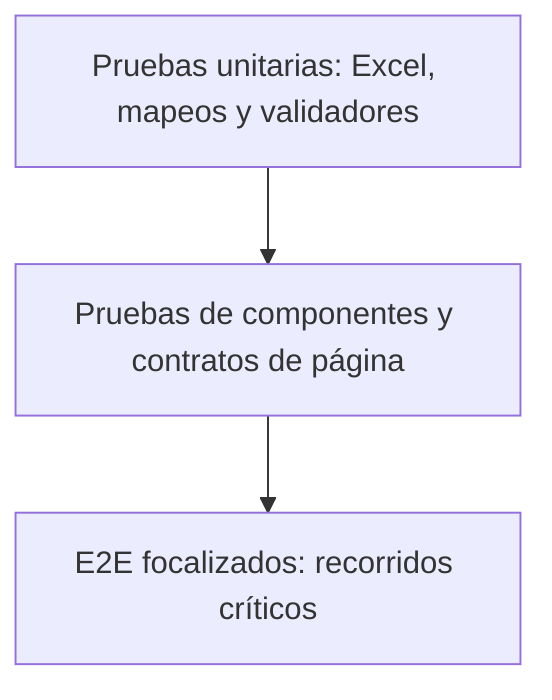

# Estrategia de pruebas

## Objetivo de calidad

La suite debe demostrar que los recorridos críticos de AF y Claims avanzan por estados visibles y consistentes usando datos de prueba controlados. El objetivo no es solo completar clics, sino validar transiciones de negocio, contenido requerido y estado final observable.

## Alcance implementado

| Área | Cobertura actual | Fuente de escenarios |
|---|---|---|
| Cotizador AF | Recorrido completo desde login hasta declaración y firmas. | Hoja `CotizadorAF`. |
| Emisión Claims AF | Login, búsqueda por folio y recorrido de secciones. | Hoja `EmisionAF`. |
| Idiomas | Selección de Esp/Eng/Port; contratos JSON completos solo en parte. | Excel + JSON. |
| Navegadores | Chromium y Firefox. | Proyectos Playwright. |
| Evidencias | Lista, HTML, video, screenshot y trace. | Configuración Playwright. |

En la auditoría del 16 de julio de 2026, Playwright descubrió 18 tests: ocho escenarios de Cotizador y uno de Emisión, repetidos en dos navegadores. Este número es una fotografía; usa `npx playwright test --list` como fuente actual.

## Tipos de validación vigentes

- URL esperada después del login AF.
- Presencia de textos visibles según idioma.
- Presencia de placeholders configurados.
- Visibilidad de secciones y modales.
- Selección de opciones y llenado de formularios.
- Recorrido de pestañas de la solicitud en Claims.
- Errores explícitos para valores de datos no soportados en varias ramas.

## Brechas actuales

- El flujo Claims registra datos en consola, pero no compara valores esperados.
- No hay pruebas unitarias para lectores, validadores o mapeos de Excel.
- No hay pruebas de API, accesibilidad o visual regression.
- No existe pipeline CI versionado.
- Los contratos de textos en inglés y portugués están referenciados pero faltan.
- Existen esperas fijas y localizadores directos fuera de Page Objects.
- El estado final del cotizador después de la firma no tiene una aserción de póliza/confirmación conectada.

Estas brechas no invalidan la arquitectura vigente; definen el orden de fortalecimiento.

## Pirámide recomendada



Evolución recomendada:

1. Mantener pocos E2E completos y representativos.
2. Añadir pruebas unitarias al parser y a las reglas de datos.
3. Separar escenarios por riesgo y etiquetas.
4. Añadir aserciones de negocio en Claims y en el estado final del cotizador.
5. Ejecutar una matriz reducida en PR y la matriz completa de forma programada.

## Criterios de diseño de casos

Cada escenario debe tener:

- propósito único y nombre legible;
- precondiciones identificables;
- datos sintéticos y trazables;
- pasos delegados a flows;
- aserciones en estados intermedios críticos;
- estado final observable;
- evidencia suficiente en falla;
- limpieza o estrategia de datos cuando el sistema cree registros.

## Selección por riesgo

Prioridad alta:

- autenticación;
- creación de cotización;
- combinaciones de plan, red, deducible y frecuencia;
- dependientes y beneficiarios;
- cuestionario médico y documentos;
- firma y aceptación legal;
- emisión por folio.

Prioridad media:

- traducciones y textos completos;
- eliminación de datos opcionales;
- modales alternos;
- combinaciones adicionales de navegador.

Prioridad baja:

- recorridos redundantes que no cambian una regla de negocio;
- variantes cosméticas sin impacto funcional.

## Estabilidad

- Esperar estados observables, no tiempos arbitrarios.
- Usar localizadores resistentes y centralizados.
- Mantener un worker mientras los datos/ambiente no soporten paralelismo seguro.
- Si se habilitan varios workers, aislar usuarios, folios y reportes.
- No ocultar fallas con retries indiscriminados.
- Una prueba intermitente debe tener evidencia, responsable y causa investigada.

## Quality gates

### Cambio documental

- Enlaces locales válidos.
- Comandos consistentes con `package.json`.
- Sin secretos ni datos reales en ejemplos.

### Cambio de código o datos

```bash
npm ci
npm run build
npx playwright test --list
```

Además:

- prueba focalizada en Chromium;
- Firefox si el cambio afecta UI o selectores;
- revisión del reporte y trace;
- actualización de documentación/Excel/JSON afectados.

### Ejecución completa

- ambiente autorizado y estable;
- todas las filas activas revisadas;
- ambos navegadores cuando la compatibilidad sea parte del objetivo;
- evidencias publicadas con retención controlada;
- incidencias separadas entre producto, datos, ambiente y automatización.

## Clasificación de fallas

| Categoría | Evidencia mínima | Acción |
|---|---|---|
| Producto | Captura/trace, paso, resultado esperado y actual. | Crear defecto funcional. |
| Automatización | Selector, espera, dato o aserción incorrecta. | Corregir la capa responsable. |
| Datos | Hoja, escenario y campo inválido. | Corregir contrato o validación. |
| Ambiente | Error de red, servicio, cuenta o dependencia. | Escalar al responsable del ambiente. |
| Intermitencia | Repeticiones y patrón de ocurrencia. | Aislar causa; no cerrar como éxito. |

## Definición de terminado

Un nuevo flujo se considera terminado cuando:

- respeta `spec → flow → page object`;
- reutiliza componentes existentes;
- valida el camino completo solicitado;
- tiene datos documentados;
- compila y se descubre;
- pasó la ejecución focalizada cuando el ambiente estuvo disponible;
- sus límites de validación quedaron explícitos;
- no expone secretos ni información sensible.
