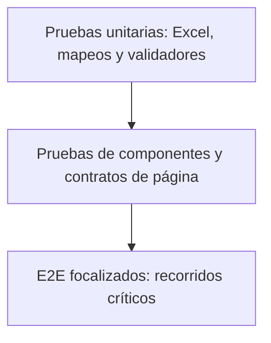

# Estrategia de pruebas

## Objetivo de calidad

La suite debe demostrar que los recorridos críticos de AF y Claims avanzan por estados visibles y consistentes usando datos de prueba controlados. El objetivo no es solo completar clics, sino validar transiciones de negocio, contenido requerido y estado final observable.

## Alcance implementado

| Área | Cobertura actual | Fuente de escenarios |
|---|---|---|
| Cotizador AF | 768 escenarios familiares e individuales, con emisión o evaluación BMI en tres idiomas. | `ConfiguracionesPlan × PerfilesCotizacion × Esp/Eng/Port`. |
| Emisión Claims AF | Cotización integrada, captura de datos, atención de la solicitud y comparación de las siete pestañas de la póliza generada. | Matriz del cotizador + hoja `EmisionAF`. |
| Validación de tarifas AF | Todos los países disponibles cruzados con los 384 escenarios de emisión en tres idiomas; valida tarifa, exclusión de BMI y folio. | Catálogo dinámico de la UI × matriz de emisión × idioma. |
| Árbol de suscripción y contrato CI | 83 casos de negocio más cuatro invariantes del catálogo crítico. | Specs focalizados en `src/tests/reglas/`. |
| Idiomas | Selección de Esp/Eng/Port; contratos JSON completos solo en parte. | Excel + JSON. |
| Navegadores | Chromium y Firefox. | Proyectos Playwright. |
| Evidencias | Lista, HTML, video, screenshot y trace. | Configuración Playwright. |

El 24 de agosto de 2026, Playwright descubrió 3246 tests: 768 escenarios de
Aplicación, 384 recorridos integrados de Emisión, 384 variantes de Validación
de tarifas y 87 reglas/contratos, repetidos en dos proyectos. Cada variante de
tarifas itera los países disponibles en tiempo de ejecución; usa el reporte
para conocer el número real de casos.

CI/CD no ejecuta esta matriz completa de forma automática. El quality gate
combina las 87 reglas rápidas con dos recorridos smoke; el nocturno rota ocho
recorridos de Aplicación en cuatro slots y agrega una integración Claims; el
semanal añade Firefox y una muestra de tarifas. La selección se administra en
`src/configuraciones/escenariosCI.ts` y no modifica la matriz local.

Los ocho recorridos rotativos cubren todos los perfiles, las ocho parejas
plan/red, cuatro frecuencias, cuatro deducibles, tres idiomas y ambos resultados
de suscripción. Esto preserva cada eje crítico sin ejecutar sus 768 productos
cartesianos en cada cambio.

## Tipos de validación vigentes

- URL esperada después del login AF.
- Presencia de textos visibles según idioma.
- Presencia de placeholders configurados.
- Visibilidad de secciones y modales.
- Selección de opciones y llenado de formularios.
- Apertura en Claims de la misma póliza generada por el cotizador.
- Activación mediante `Atender solicitud` antes de leer los datos de emisión.
- Comparación campo a campo en Información general, Coberturas, Cuestionario, Plan y frecuencia, Idioma, Limitaciones y Contrato.
- Registro JSON por ejecución con estados `Coincide`, `CoincidenciaParcial`, `Diferente` y `NoComparable`, además de resúmenes por pestaña. Una coincidencia parcial representa una selección o label traducido de forma válida; no se aplica a texto libre.
- Registro del avance parcial y la etapa cuando una sección no puede leerse.
- Errores explícitos para valores de datos no soportados en varias ramas.
- Resultado explícito de emisión o evaluación BMI y objetivo antropométrico trazable.
- En la matriz activa, la evaluación BMI se espera únicamente cuando el objetivo es el titular; BMI de dependientes queda reservado para un flujo adicional.
- Tarifa monetaria positiva por país y variante, rechazo explícito de cualquier salida BMI y folio final de 12 dígitos.
- Cobertura cartesiana comprobada en el reporte por país y por variante, sin depender de una lista estática de países.
- Precedencia de decisiones comprobada sin crear solicitudes: bloqueo 77+, rechazo del titular, exclusión de dependientes, UW y enrutamiento a Nuevas/Pendientes/Rechazadas.

## Brechas actuales

- Los lectores, validadores y mapeos de Excel aún no tienen pruebas unitarias; las reglas de suscripción sí cuentan con una suite focalizada.
- No hay pruebas de API, accesibilidad o visual regression.
- Los E2E de PR que necesitan secretos se omiten en forks; las reglas y la compilación sí se ejecutan.
- Los contratos de textos en inglés y portugués están referenciados pero faltan.
- Existen esperas fijas y localizadores directos fuera de Page Objects.
- El gateway de pago externo puede introducir intermitencia en la redirección final.

Estas brechas no invalidan la arquitectura vigente; definen el orden de fortalecimiento.

## Pirámide recomendada



Evolución recomendada:

1. Mantener pocos E2E completos y representativos.
2. Añadir pruebas unitarias al parser y a las reglas de datos.
3. Separar escenarios por riesgo y etiquetas.
4. Añadir aserciones de negocio en Claims y en el estado final del cotizador.
5. Ejecutar una matriz reducida en PR, rotar ejes críticos durante la semana y reservar la matriz completa para una ventana manual.

## Criterios de diseño de casos

Cada escenario debe tener:

- propósito único y nombre legible;
- precondiciones identificables;
- datos sintéticos y trazables;
- pasos delegados a flows;
- aserciones en estados intermedios críticos;
- estado final observable;
- evidencia suficiente en falla;
- limpieza o estrategia de datos cuando el sistema cree registros.

## Selección por riesgo

Prioridad alta:

- autenticación;
- creación de cotización;
- combinaciones de plan, red, deducible y frecuencia;
- dependientes y beneficiarios;
- cuestionario médico y documentos;
- firma y aceptación legal;
- emisión por folio.

Prioridad media:

- traducciones y textos completos;
- eliminación de datos opcionales;
- modales alternos;
- combinaciones adicionales de navegador.

Prioridad baja:

- recorridos redundantes que no cambian una regla de negocio;
- variantes cosméticas sin impacto funcional.

## Estabilidad

- Esperar estados observables, no tiempos arbitrarios.
- Usar localizadores resistentes y centralizados.
- Mantener `fullyParallel` deshabilitado mientras AF y Claims utilicen cuentas compartidas.
- Ejecutar perfiles E2E de CI con un worker; las reglas puras pueden usar cuatro porque no abren sesión ni crean datos.
- Mantener folios y reportes aislados por worker.
- No ocultar fallas con retries indiscriminados.
- Una prueba intermitente debe tener evidencia, responsable y causa investigada.

## Quality gates

### Cambio documental

- Enlaces locales válidos.
- Comandos consistentes con `package.json`.
- Sin secretos ni datos reales en ejemplos.

### Cambio de código o datos

```bash
npm ci
npm run build
npm run test:ci:reglas
npm run test:ci:list
```

Además:

- prueba focalizada en Chromium;
- Firefox si el cambio afecta UI o selectores;
- revisión del reporte y trace;
- actualización de documentación/Excel/JSON afectados.

### Ejecución completa

- ambiente autorizado y estable;
- todas las filas activas revisadas;
- ambos navegadores cuando la compatibilidad sea parte del objetivo;
- activación manual del perfil `full`, nunca por calendario;
- evidencias publicadas con retención controlada;
- incidencias separadas entre producto, datos, ambiente y automatización.

## Clasificación de fallas

| Categoría | Evidencia mínima | Acción |
|---|---|---|
| Producto | Captura/trace, paso, resultado esperado y actual. | Crear defecto funcional. |
| Automatización | Selector, espera, dato o aserción incorrecta. | Corregir la capa responsable. |
| Datos | Hoja, escenario y campo inválido. | Corregir contrato o validación. |
| Ambiente | Error de red, servicio, cuenta o dependencia. | Escalar al responsable del ambiente. |
| Intermitencia | Repeticiones y patrón de ocurrencia. | Aislar causa; no cerrar como éxito. |

## Definición de terminado

Un nuevo flujo se considera terminado cuando:

- respeta `spec → flow → page object`;
- reutiliza componentes existentes;
- valida el camino completo solicitado;
- tiene datos documentados;
- compila y se descubre;
- pasó la ejecución focalizada cuando el ambiente estuvo disponible;
- sus límites de validación quedaron explícitos;
- no expone secretos ni información sensible.
