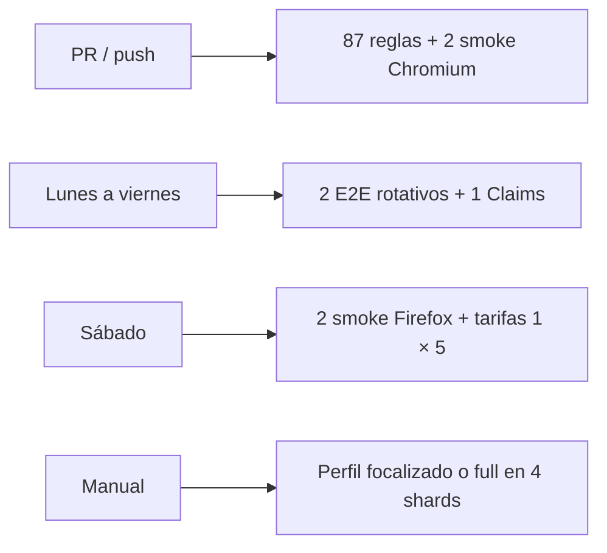

# Operación y mantenimiento

## Fuentes de verdad operativas

| Tema | Archivo |
|---|---|
| Scripts y dependencias | `package.json` |
| Resolución reproducible | `package-lock.json` |
| Configuración Playwright | `playwright.config.ts` y `src/configuraciones/playwright.config.ts` |
| TypeScript y aliases | `tsconfig.json` |
| Escenarios | `src/datos/SuitePruebas.xlsx` |
| Análisis estático | `sonar-project.properties` |

## Rutina de mantenimiento

### En cada cambio

- Revisar `git diff` y evitar artefactos generados.
- Compilar con `npm run build`.
- Confirmar descubrimiento con `npx playwright test --list`.
- Ejecutar el escenario afectado en Chromium.
- Ejecutar Firefox si cambia UI, iframe, selector o navegación.
- Actualizar documentación y contratos de datos afectados.

### Semanal o por ciclo de entrega

- Ejecutar smoke de recorridos críticos.
- Revisar inestabilidad y duración.
- Depurar evidencias vencidas.
- Verificar cuentas y datos de automatización.
- Revisar textos faltantes nuevos.

### Mensual o en ventana acordada

- Revisar `npm outdated` y `npm audit`.
- Validar versiones LTS de Node y npm.
- Comprobar compatibilidad de navegadores.
- Revisar secretos, permisos y rotación.
- Confirmar que la documentación siga las fuentes de verdad.

## Actualización de dependencias

1. Crear un cambio aislado.
2. Registrar versiones antes de actualizar.
3. Revisar notas de Playwright, TypeScript y librerías Excel.
4. Actualizar `package.json` y `package-lock.json` juntos.
5. Ejecutar:

```bash
npm ci
npm audit
npm run build
npx playwright test --list
```

6. Correr un escenario focalizado por navegador.
7. Verificar lectura de Excel, carga de archivos y reporte HTML.
8. Explicar cualquier dependencia que no pueda actualizarse.

No mezcles una actualización amplia con un cambio funcional grande.

## Datos y baselines

- El Excel debe tener un responsable funcional.
- Un encabezado es parte del contrato con el código.
- Los JSON esperados deben revisarse cuando cambie contenido de producto.
- Los archivos `textosFaltantes` son resultados, no nuevos baselines automáticos.
- Un texto nuevo solo debe incorporarse al baseline después de validación funcional.

## SonarQube

El archivo actual conserva metadatos de otro proyecto y un token versionado. Antes de usar Sonar como quality gate:

1. rotar y externalizar el token;
2. definir key y nombre propios de AutomatizacionAF;
3. configurar URLs reales del repositorio;
4. eliminar `.scannerwork/` del control de versiones;
5. decidir cobertura: hoy no se genera `coverage/lcov.info`;
6. ejecutar el scanner en CI, no depender de una instancia local individual.

## CI/CD vigente

La automatización separa señal rápida, cobertura rotativa y regresión bajo
demanda para que una matriz de miles de casos no bloquee cada cambio:



Workflows versionados:

- `quality-gate.yml`: compila y ejecuta reglas; después corre dos smoke en Chromium. En PR de forks omite el E2E que requiere secretos.
- `nightly-critical.yml`: rota cuatro slots; en una semana laboral cubre todos los perfiles críticos y ejecuta la integración AF–Claims.
- `weekly-coverage.yml`: ejecuta los smoke en Firefox y una variante de tarifa sobre cinco países distribuidos.
- `regression-manual.yml`: permite `smoke`, `critical`, `integration`, `tarifas`, `reglas` o `full`; el perfil completo no tiene calendario.

Los jobs E2E usan concurrencia por ambiente, un worker en perfiles focalizados,
timeouts explícitos y falla temprana. Las evidencias automáticas se publican sólo
en falla durante siete días. No añadas una ejecución programada de la matriz
completa: si surge una brecha, primero incorpora una regla rápida, un escenario
al catálogo rotativo o un perfil focalizado.

## Portabilidad

- El script `clean` actual es específico de Windows.
- `test:headless` es portable, pero ejecuta una cobertura amplia; para CI se deben usar los perfiles `test:ci:*`.
- El script `merge-polizas` requiere `ts-node`, pero esa herramienta no está declarada como dependencia.
- La documentación solo considera soportados los comandos confirmados en [Ejecución](EJECUCION.md).
- Una corrección futura debe ser compatible con Windows, macOS y Linux o declarar explícitamente la plataforma.

## Observabilidad de la suite

Métricas recomendadas:

- duración total y por escenario;
- tasa de éxito por navegador;
- fallas por producto/automatización/datos/ambiente;
- reintentos e intermitencia;
- antigüedad de tests inestables;
- volumen y costo de evidencias;
- escenarios activos por área de riesgo.

No uses solo el porcentaje de éxito: una suite que no descubre tests también puede terminar sin fallas si no existe un gate de conteo esperado.

## Baja o modificación de un flujo

1. Confirmar con el responsable funcional.
2. Identificar spec, flow, páginas, columnas, JSON y evidencias relacionadas.
3. Eliminar solo lo que ya no tenga consumidores.
4. Conservar lógica compartida.
5. Actualizar documentación y matriz de cobertura.
6. Ejecutar compilación, listado y regresión focalizada.
